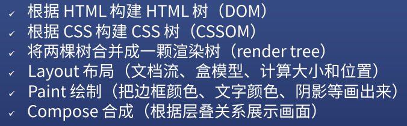

# CSS知识总结

## 1.浏览器渲染原理

* 渲染树构建
* 布局
* 绘制
  


## 2.CSS 动画的两种做法 

### transition

作用：补充中间帧，使动画效果更流畅

* 给需要做动画效果的元素添加一个 hover 属性，如：
  ```css
  .heart:hover{
  transform: scale(1.5);
  }
  ```
* 然后在该元素里添加 transition (语法：transition: 属性名 时长 过渡方式 延迟;)；属性名可以是“left,top,margin-right,all”这些表示方位的，如：
  ```css
  .heart{
  transition: all 1s;
  }
  ```

### animation

* 给需要做动画效果的元素添加一个 声明关键帧 @keyframes ，如：
  ```css
  @keyframes heart {
  0%{
  transform:scale(1.0)
  }
  100%{
  transform:scale(1.5)
  }
  }
  ```
* 然后在该元素里添加 animation (语法：animation:时长 过渡方式 延迟 次数 方向 填充模式 是否暂停 动画名;)，如：
  ```css
  .heart{
  animation: heart 900ms infinite alternate;
  }
  ```
* infinite 次数：无数次；alternate 方向：正反交替
  
## 心得体会

* transition 可以用来优化鼠标交互动画
* animation 适合用来做展示动画